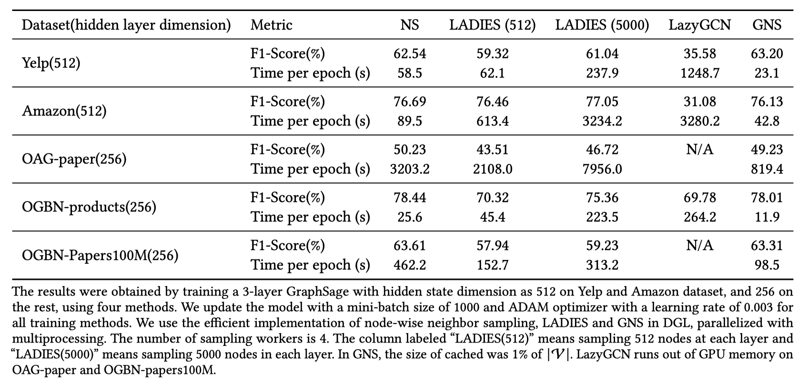

[Global Neighbor Sampling for Mixed CPU-GPU Training on Giant Graphs (GNS)](https://arxiv.org/abs/2106.06150)

Jialin Dong\*, [Da Zheng](https://zheng-da.github.io/)\*, [Lin F. Yang](http://drlinyang.net/), [Geroge Karypis](http://glaros.dtc.umn.edu/)

**Contact**


Da Zheng (dzzhen@amazon.com), Jialin Dong (jialind@g.ucla.edu)


Feel free to report bugs or tell us your suggestions!


## Overview
We propose a new effective sampling framework to accelerate GNN mini-batch training on giant graphs by removing the main bottleneck in mixed CPU-GPU training. GNS creates a global cache to facilitate neighbor sampling and periodically updates the cache. Therefore, it reduces data movement between CPU and GPU.
 
 We empirically demonstrate the advantages of the proposed algorithm in convergence rate, computational time, and scalability to giant graphs. Our proposed method has a significant speedup in training on large-scale dataset. We also theoretically analyze GNS and show that even with a small cache size, it enjoys a comparable convergence rate as the node-wise sampling method.

GNS shares many advantages of various sampling methods and is able to avoid their drawbacks. 

Like node-wise neighbor sampling, e.g., [Graphsage](https://github.com/dmlc/dgl/tree/master/examples/pytorch/graphsage),
it samples neighbors on each node independently and, thus, can be implemented and parallelized efficiently.
Due to the cache, GNS tends to avoid the neighborhood explosion in multi-layer GNN. 

GNS maintains
a global and static distribution to sample the cache, which requires only one-time computation and can be easily
amortized during the training. In contrast, [LADIES](https://github.com/BarclayII/dgl/tree/ladies/examples/pytorch/ladies) computes the sampling distribution for every layer
in every mini-batch, which makes the sampling procedure expensive.
 
Even though GNS constructs
a mini-batch with more nodes than LADIES, forward and backward computation on a mini-batch is not
the major bottleneck in many GNN models for mixed CPU-GPU training.

Even though both GNS and [LazyGCN](https://github.com/MortezaRamezani/lazygcn) deploy caching to accelerate computation in mixed CPU-GPU training,
they use cache very differently.
GNS uses cache to reduce the number of nodes in a mini-batch to reduce computation and data movement between CPU and GPUs.
It captures majority of connectivities of nodes in a graph.
 
 LazyGCN caches and reuses
the sampled graph structure and node data. This requires a large mega-batch size to achieve good accuracy,
which makes it difficult to scale to giant graphs. Because LazyGCN uses node-wise sampling
or layer-wise sampling to sample mini-batches, it suffers from the problems inherent to
these two sampling algorithms. 

## Requirements


* python >= 3.6.0
* pytorch >= 1.6.0
* dgl >=0.7.0
* Numpy>=1.16.0
* scipy >= 1.1.0
* scikit-learn >= 0.19.1
* tqdm >= 2.2.4
* scikit-learn>=0.20.0


## Datasets


All datasets used in our papers are available for download.

Available in https://github.com/GraphSAINT/GraphSAINT
* Yelp
* Amazon

Available in [DGL](https://github.com/dmlc/dgl) library
* OAG-paper
* OGBN-products
* OGBN-Papers100M


Results
-------

### Training

Check out a customized DGL from [here](https://github.com/zheng-da/dgl/tree/new_sampling).

```
git clone https://github.com/zheng-da/dgl.git
cd dgl
git checkout new_sampling
```

Follow the instruction [here](https://doc.dgl.ai/install/index.html) to install DGL from source.

The following commands train GraphSage with GNS.

```bash
python3 GNS_sampling_prob.py --dataset ogbn-products    # training on OGBN-products
python3 GNS_sampling_prob.py --dataset oag_max_paper.dgl     # training on OAG-paper, OGBN-products and OGBN-Papers100M
python3 GNS_sampling_prob.py --dataset ogbn-papers100M   # training on OGBN-Papers100M
python3 GNS_yelp_amazon.py --dataset yelp   # training on Yelp
python3 GNS_yelp_amazon.py --dataset amazon   # training on Amazon
```

Test set F1-Score summarized below.



## Citation 

```
@inproceedings{GNS-KDD21,
title={Global Neighbor Sampling for Mixed {CPU}-{GPU} Training on Giant Graphs},
author={Dong, Jialin and Zheng, Da and Yang, Lin F and Karypis, Geroge}
booktitle={ booktitle={Proceedings of the 27th ACM SIGKDD International Conference on Knowledge Discovery \& Data Mining},},
year={2021}
}
```
